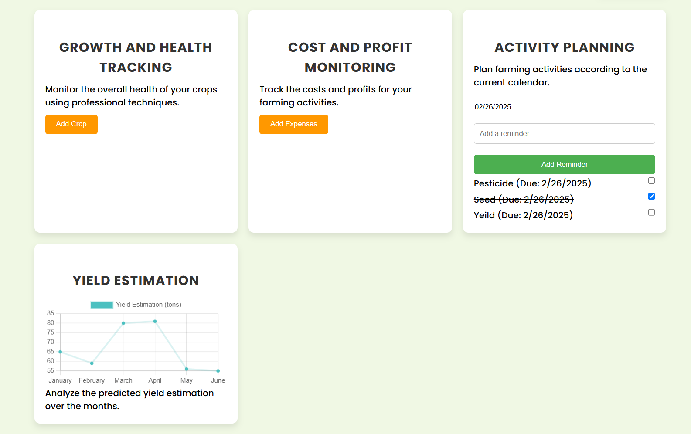

# Farm Manager - For The Farmers 🌱 

&nbsp;

## Prototype Screenshots

<table>
  <tr>
    <td align="center">
      
      <br/>
      <b>Homepage View</b>
    </td>
    <td align="center">
      
      <br/>
      <b>Dashboard View</b>
    </td>
  </tr>
</table>

## Overview
Farm Manager is a specialized platform tailored for farmers to effectively manage their crops and financial data. It focuses on simplifying crop planning, providing data visualization, maintaining detailed crop information, and tracking expenses and profitability.

## Features
- **Crop Planning**: Plan and manage crop schedules for efficient farming.
- **Data Visualization**: View farm data insights through intuitive charts and graphs.
- **Crop Information**: Maintain detailed records about crops, including growth stages, requirements, and yields.
- **Expense and Profit Analysis**: Track all expenses and calculate profitability to improve financial decisions.

## Technologies Used
- **Frontend**: React

## Installation

1. Clone the repository:
   ```bash
   git clone https://github.com/shubhamaher8/Farm-Manager.git
   ```

2. Navigate to the project directory:
   ```bash
   cd farm-manager
   ```

3. Install dependencies:
   ```bash
   npm install
   ```

4. Start the development server:
   ```bash
   npm start
   ```

## Usage
- Visit `http://localhost:3000` in your browser.
- Use the dashboard to manage crops, visualize data, view crop information, and analyze financial performance.

## Deployment
[](https://farm-manager-lake.vercel.app/)

[](https://farm-manager-lake.vercel.app/)

## Contributing
We welcome contributions to improve Farm Manager. Please follow these steps:
1. Fork the repository.
2. Commit the changes
3. Push the repo with changes
4. Create a new branch for your feature/bug fix.
5. Commit your changes and push them to your branch.
6. Submit a pull request with a detailed description of your changes.

---
Feel free to suggest improvements or report issues via GitHub Issues.
